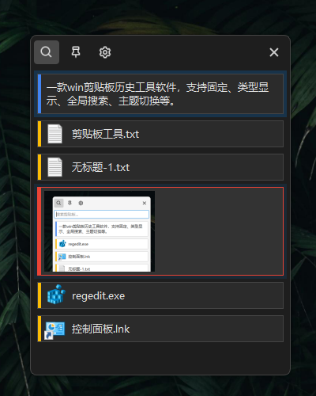

#  MyClip

一款win剪贴板历史工具软件，支持固定、类型显示、全局搜索、主题切换等。

## 🌟 功能特点

- 🎨 支持图片、富文本、文件路径剪贴板历史。
- 🔍 剪贴板历史全文搜索
- 🌗 支持夜间主题、主题自动、手动切换
- 🎹 自定义全局热键
- 📌 固定剪贴板历史
- 🧾 sqlite本地数据库
- 💡 完全开源

## ✅ 下载地址

下载按钮

- 蓝奏云：[GitHub Releases](https://github.com/srwi/EverythingToolbar/releases)
- Github下载链接： [GitHub Releases](https://github.com/csdj87/MyClip/releases)

## 💖 支持捐赠

如果你喜欢MyClip，我会非常感谢你的支持，开发者自己正在使用这个软件！

您可以通过在GitHub上给一颗星星⭐鼓励一下下~

您也可以捐款（金额不限）来表达您的感激之情!

## 🛠️ 定制开发

如需定制开发，可联系微信dreambig